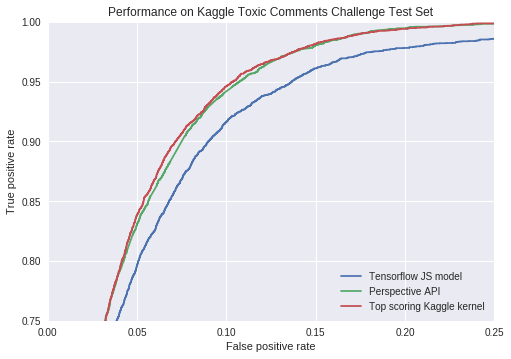
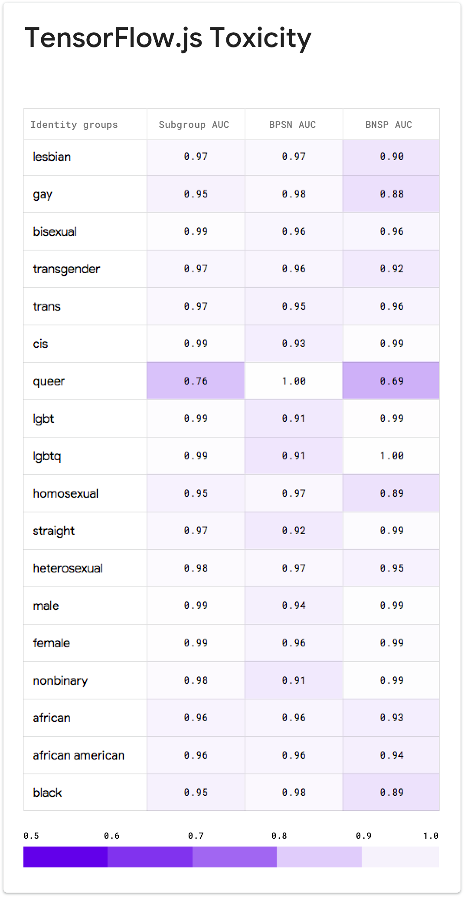

# Toxicity

The toxicity model classifies whether a comment is a rude, disrespectful, or
unreasonable comment that is likely to make people leave a discussion.

## Overview

A modestly sized model based upon the Universal Sentence Encoder lite, suitable
for client side (in browser) classificiation applications.

## Intended use

#### Human-assisted moderation

Make moderation easier with an ML assisted tool that helps prioritize comments
for human moderation, and create custom tasks for automated actions. See our
[moderator tool](https://github.com/conversationai/conversationai-moderator) as
an example.

#### Author feedback

Assist authors in real-time when their comments might violate your community
guidelines or be may be perceived as “Toxic” to the conversation. Use simple
feedback tools when the assistant gets it wrong. See our
[authorship demo](https://github.com/conversationai/perspectiveapi-authorship-demo)
as an example.

#### Read better comments

Organize comments on topics that are often difficult to discuss online. Build
new tools that help people explore the conversation.

## Uses to avoid

#### Fully automated moderation

This model is not intended to be used for fully automated moderation. Machine
learning models will always make some mistakes, so it is essential to build in
systems for humans to catch and correct those mistakes.

#### Character judgement

This model only helps detect toxicity in an individual statement, and is not
intended to detect anything about the individual who said it.

## Model details

#### Training data

User generated news comments published between 2015-2017. Released under
Creative Commons CC0, available at
[figshare](https://github.com/conversationai/perspectiveapi.git).

#### Model architecture

Using the [TF Hub Universal Sentence Coder Lite](https://tfhub.dev/google/universal-sentence-encoder-lite/2),
this model adds 3 layers and a
set of output heads based on Tensorflow Estimator. The code for this model is
available as part of the [Jigsaw open-source model
building](https://github.com/conversationai/conversationai-models) project, in
the [tf\_hub\_tfjs
directory](https://github.com/conversationai/conversationai-models/tree/master/experiments/tf_trainer/tf_hub_tfjs).

#### Values

[Community, Transparency, Inclusivity, Privacy, and Topic neutrality](https://conversationai.github.io/).
These values guide our product and research decisions.

## Evaluation data

#### Overall evaluation data

The overall evaluation result (shown above) is calculated via a [colab
notebook](https://github.com/conversationai/conversationai-models/blob/master/experiments/tf_trainer/tf_hub_tfjs/notebook/EvaluatingClassifier.ipynb)
using the held out test set associated with the training set for the specific
model.
The model also produces a number of additional scores for other attributes
based upon crowd rater annotations, but these have not been evaluated
for quality of bias.

#### Unintended bias evaluation data

The unintended bias evaluation result is calculated using a synthetically
generated test set where a range of identity terms are swapped into template
sentences, both toxic and non-toxic. Results are presented grouped by identity
term. Note that this evaluation looks at only the identity terms present in the
text. We do not look at the identities of comment authors or readers to protect
the privacy of these users.

#### Group factors

Identity terms referencing frequently attacked groups, focusing on sexual
orientation, gender identity, and race.

#### Caveats

The current synthetic test data covers only a small set of very specific
comments and identities. While these are designed to be representative of common
use cases and concerns, it is not comprehensive.

## Unitary Identity Subgroup Evaluation

To measure unintended bias, we follow the definitions presented in
the model card for the larger, [server based models](toxicity.md).

Below are unintended bias evaluation results for a subset of identities for the
current version of this model. The bias evaluation notebook is for
[review](https://github.com/conversationai/conversationai-models/blob/master/experiments/tf_trainer/tf_hub_tfjs/notebook/BiasEvaluation.ipynb),
along with the [full list of identity terms results](https://docs.google.com/spreadsheets/d/19Wy-o7604HjDk-cUTo3hSutKsHOZ_Y73zyrQyTmrjNA/edit?usp=sharing).

#### Get involved

If you have any questions, feedback, or additional things you'd like to see in
the model card,
[please reach out to us here.](https://docs.google.com/forms/d/e/1FAIpQLScgwNY8PAsVxwYRSknUUHBU2Lai85rqeOuD17lTDWmDEUqq3Q/viewform)
